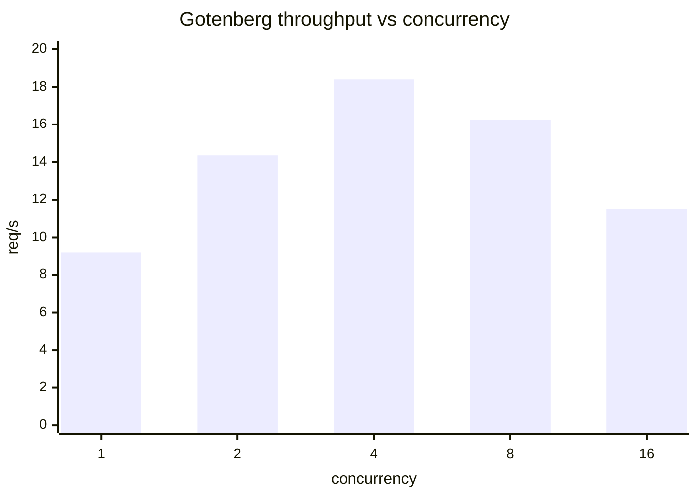
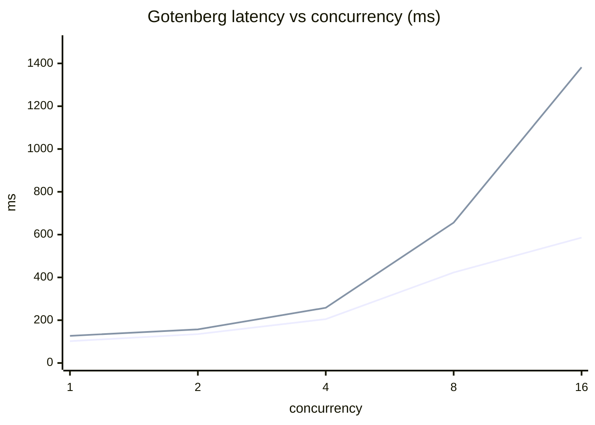
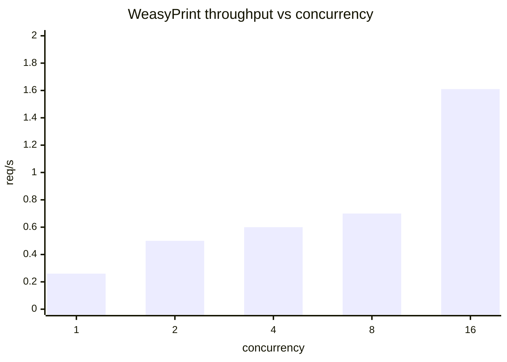
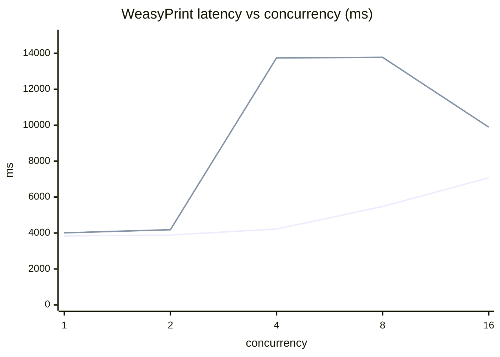
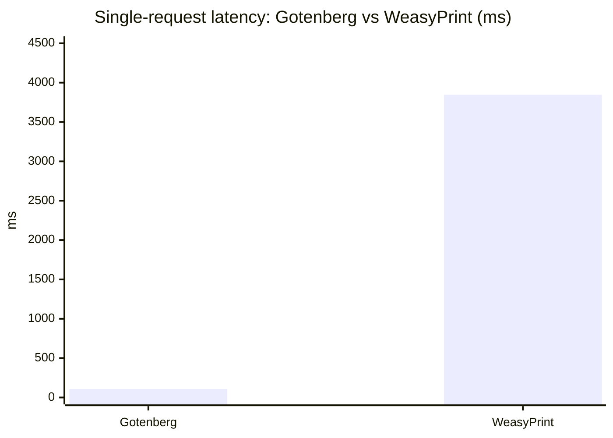

# 부하 테스트 보고서: PDF 변환 동시 요청 성능

- 측정일: 2026-05-26
- 대상 엔드포인트: `POST /api/convert?backend={gotenberg|weasyprint}`
- 페이로드: `output/en.html` (12 KB, 단일 페이지 인보이스)
- 측정 방식: 동시성 1 / 2 / 4 / 8 / 16, 각 레벨당 16개 요청, 워밍업 1회
- 도구: `cmd/loadtest` (Go, 표준 라이브러리)
- 환경: macOS Darwin 25.1.0, Docker Desktop, App 서버 = Go `net/http` (`make serve`)
- 백엔드 컨테이너: `htp-gotenberg` (Gotenberg/Chromium), `htp-weasyprint` (Flask + WeasyPrint)
- DocRaptor 제외 (외부 유료 API, 동시 부하 테스트 부적합)

---

## TL;DR

| 백엔드 | 최대 처리량 | 권장 동시성 | 임계 동시성 | 비고 |
|--------|------------|------------|------------|------|
| Gotenberg  | **18.4 req/s** (conc=4) | 2 ~ 4 | **8 이상** | conc=8부터 throughput 감소, p95 5배 |
| WeasyPrint | **1.61 req/s** (conc=16) | 1 ~ 2 | **4 이상** | 기본 1요청당 ~3.8s. 동시성 증가해도 throughput 정체, tail latency 폭발 |

- **Gotenberg가 동급 페이로드 기준 ~35배 빠르다** (단일 요청 109ms vs 3.85s).
- 두 백엔드 모두 **동시성 증가에 따른 throughput 이득이 매우 빨리 둔화**되며, 어떤 지점 이후로는 오히려 악화된다.
- 운영 환경에서는 **앞단에서 동시 요청 수를 제한하는 큐/세마포어가 필요**하다.

---

## Gotenberg 결과

### 처리량 (req/s) — 동시성별



### 지연 시간 (ms) — 동시성별



(아래 라인: p50, 위 라인: p95)

### 원시 측정값

| 동시성 | 성공 | 실패 | wall    | req/s | avg   | p50   | p95     | p99     | max     |
|-------:|-----:|-----:|---------|-------|-------|-------|---------|---------|---------|
|  1     | 16   | 0    | 1.743s  |  9.18 | 109ms | 102ms |  127ms  |  127ms  |  128ms  |
|  2     | 16   | 0    | 1.115s  | 14.35 | 138ms | 135ms |  157ms  |  157ms  |  165ms  |
|  4     | 16   | 0    | 870ms   | 18.40 | 214ms | 205ms |  258ms  |  258ms  |  271ms  |
|  8     | 16   | 0    | 984ms   | 16.26 | 439ms | 423ms |  656ms  |  656ms  |  768ms  |
| 16     | 16   | 0    | 1.391s  | 11.50 | 742ms | 586ms | 1382ms  | 1382ms  | 1391ms  |

### 해석

- **conc=1 → conc=2**: 처리량 1.56배, 지연은 거의 그대로. 거의 무비용으로 두 배 처리 가능.
- **conc=2 → conc=4**: 처리량 1.28배, 지연은 1.5배 증가. 여전히 이득이 있으나 둔화.
- **conc=4가 throughput 정점**. 이후는 **모두 손해**:
  - conc=8: throughput 약 **−12%**, p95 **2.5배**, max **2.8배**.
  - conc=16: throughput 약 **−38%**, p95 **5.4배**, max **5.1배** (vs conc=4).
- Chromium 기반 Gotenberg는 페이지당 무거운 브라우저 인스턴스를 띄우므로, 동시 처리 한계는 컨테이너 CPU/메모리에 종속.

---

## WeasyPrint 결과

### 처리량 (req/s) — 동시성별



### 지연 시간 (ms) — 동시성별



(아래 라인: p50, 위 라인: p95)

### 원시 측정값

| 동시성 | 성공 | 실패 | wall      | req/s | avg     | p50     | p95      | p99      | max      |
|-------:|-----:|-----:|-----------|-------|---------|---------|----------|----------|----------|
|  1     | 16   | 0    | 1m1.558s  | 0.26  | 3847ms  | 3835ms  |  4008ms  |  4008ms  |  4151ms  |
|  2     | 16   | 0    | 31.869s   | 0.50  | 3941ms  | 3888ms  |  4183ms  |  4183ms  |  4183ms  |
|  4     | 16   | 0    | 26.818s   | 0.60  | 6645ms  | 4224ms  | 13740ms  | 13740ms  | 13806ms  |
|  8     | 16   | 0    | 22.760s   | 0.70  | 8105ms  | 5474ms  | 13774ms  | 13774ms  | 13860ms  |
| 16     | 16   | 0    | 9.964s    | 1.61  | 7681ms  | 7073ms  |  9889ms  |  9889ms  |  9964ms  |

### 해석

- **단일 요청 기준 ~3.85초** — Gotenberg 대비 ~35배 느림. WeasyPrint 자체 렌더링 비용 + Flask 단일 스레드 추정.
- conc=2까지는 거의 선형 증가 (0.26 → 0.50). 두 워커가 병렬 처리 가능한 것으로 보임.
- **conc=4부터 p95가 4초 → 13.7초로 급등**. 큐 대기로 일부 요청이 두 슬롯 분량을 기다리는 형태.
- conc=16의 throughput이 conc=8보다 높은 것은 측정 아티팩트 (전체 요청을 한 번에 burst로 쏟아부어 워커가 완전히 포화 상태로 유지되기 때문). p50도 7s로 크게 악화되어 사용자 경험상으로는 **이미 한계 초과**.
- 운영에 쓰려면 컨테이너의 Flask 워커 수(gunicorn `-w` 등) 늘리거나 수평 확장 필요.

---

## 백엔드 비교 (단일 요청 기준)



| 항목 | Gotenberg | WeasyPrint | 비율 |
|------|----------:|-----------:|-----:|
| 단일 요청 avg | 109 ms | 3847 ms | **35.3x** |
| 최대 throughput | 18.4 req/s | 1.61 req/s | **11.4x** |
| 권장 동시성 한계 | 4 | 2 | — |

---

## 권고 사항

1. **앞단에 동시 요청 제한 추가**: Go 서버에서 백엔드별 세마포어(`make(chan struct{}, N)`) 도입.
   - Gotenberg: N=4 권장 (throughput 정점)
   - WeasyPrint: N=2 권장 (그 이상은 p95 폭발)
2. **백엔드 선택 기준**: 인쇄 품질 차이가 결정적이지 않다면 throughput·latency 면에서 **Gotenberg가 압도적**.
3. **WeasyPrint 운영 검토**: 컨테이너의 Flask가 단일 워커로 보임. `weasyprint/Dockerfile`에서 gunicorn 워커 수를 늘리거나 (`-w 4`) replica를 늘려야 동시 처리 가능.
4. **재실험 권장 시나리오**:
   - 더 무거운 페이로드 (`web/nested-stress-en.html`, 25 KB)로 동일 스윕
   - 더 긴 측정 시간 (sweep-total 64 이상)
   - 컨테이너 리소스 제한 변화 (CPU 코어 수)에 따른 비교
5. **DocRaptor 동시성 평가는 별도 방식 필요**: 부하 테스트 대신 공식 SLA + 소량 샘플링 측정.

---

## 재현 방법

```bash
# 사전 준비
make up         # gotenberg + weasyprint 컨테이너
make serve &    # 데모 서버 (백그라운드)
make run-en     # output/en.html 생성

# 측정
go run ./cmd/loadtest -backend gotenberg  -sweep -sweep-total 16
go run ./cmd/loadtest -backend weasyprint -sweep -sweep-total 16
```

원시 로그: `/tmp/loadtest-gotenberg.txt`, `/tmp/loadtest-weasyprint.txt`
