# 템플릿 × 언어 × 백엔드 매트릭스 부하 테스트 보고서

> 이 보고서는 **6 템플릿 × 3 언어 × 2 백엔드 = 36 셀**에서 baseline + 동시성 4 부하 결과를 본다.
> 동시성 1~16 스윕 곡선은 [`load-test-2026-05-26.md`](load-test-2026-05-26.md) 참조.
> 인덱스: [`README.md`](README.md)

- 측정일: 2026-05-26
- 대상: `POST /api/convert?backend={gotenberg|weasyprint}`
- 매트릭스: **템플릿 6 × 언어 3 × 백엔드 2 = 36 셀**
- 측정 차원 (각 셀):
  - **baseline**: 동시성 1, 단일 요청 — 순수 처리 시간
  - **concurrent**: 동시성 4, 8 요청 — 동시 부하 처리량
- 도구: `cmd/matrix` (Go 표준 라이브러리)
- 원시 CSV: `reports/matrix-2026-05-26.csv`
- DocRaptor 제외 (외부 유료 API)

---

## TL;DR — 가장 중요한 발견

> **WeasyPrint는 CJK(한국어/일본어) 콘텐츠에서 영어 대비 최대 57배 느려진다.**
> Gotenberg는 1.5~2배 정도로 차이가 크지 않다. 이 프로젝트의 1차 타깃 언어가 ko/ja인 점을 고려하면, **WeasyPrint는 CJK 운영에 부적합**하다.

| 백엔드 | 가장 빠른 셀 | 가장 느린 셀 | 격차 |
|--------|------------|------------|------|
| Gotenberg  | `nested-basic/en`  61 ms | `invoice/ja` 392 ms | **6.4x** |
| WeasyPrint | `nested-basic/en` 61 ms | `nested-stress/ja` 4844 ms | **79x** |

추가 발견:
1. **WeasyPrint 컨테이너가 부하 중 C 레벨 메모리 오류(`free(): invalid pointer`)로 다운**. 운영에 사용하려면 재시작 정책 + 워커 분리 필요.
2. **언어 효과 ≫ 템플릿 복잡도 효과** (특히 WeasyPrint). CJK 렌더링 코스트 자체가 지배적.
3. **Gotenberg 동시 처리량은 영문에서 최대 27.6 req/s** (`nested-basic/en`), CJK·복잡 템플릿에서도 6~13 req/s 유지.
4. **WeasyPrint + CJK + 동시성 4 → p95 12~21초**. 실질적으로 동시 트래픽 불가.

---

## 1. Baseline 지연 (단일 요청, ms)

### 1-1. Gotenberg

```mermaid
xychart-beta
    title "Gotenberg baseline latency by template & language (ms)"
    x-axis "template" ["nested-basic", "invoice", "nested-deep", "nested-split", "nested-projects", "nested-stress"]
    y-axis "ms" 0 --> 450
    bar [189, 232, 147, 141, 158, 164]
    bar [131, 392, 234, 167, 162, 200]
    bar [61, 127, 84, 80, 85, 96]
```



(3개 막대 = ko / ja / en 순)

### 1-2. WeasyPrint

```mermaid
xychart-beta
    title "WeasyPrint baseline latency by template & language (ms)"
    x-axis "template" ["nested-basic", "invoice", "nested-deep", "nested-split", "nested-projects", "nested-stress"]
    y-axis "ms" 0 --> 5000
    bar [3457, 4312, 2767, 2922, 3520, 4662]
    bar [2889, 4484, 2936, 3146, 3428, 4844]
    bar [61, 3799, 168, 391, 363, 1004]
```



(3개 막대 = ko / ja / en 순)

### 1-3. Baseline 표 (모든 36 셀)

| Template          | KB   | Lang | Gotenberg | WeasyPrint | WeasyP / Gtb |
|-------------------|-----:|:----:|----------:|-----------:|-------------:|
| nested-basic      |  5.5 | ko   |   189 ms  |   3457 ms  | **18.3x**    |
| nested-basic      |  5.6 | ja   |   131 ms  |   2889 ms  | **22.1x**    |
| nested-basic      |  5.4 | en   |    61 ms  |     61 ms  |  1.0x        |
| invoice           | 12.5 | ko   |   232 ms  |   4312 ms  | 18.6x        |
| invoice           | 12.5 | ja   |   392 ms  |   4484 ms  | 11.4x        |
| invoice           | 12.2 | en   |   127 ms  |   3799 ms  | 29.9x        |
| nested-deep       | 13.3 | ko   |   147 ms  |   2767 ms  | 18.8x        |
| nested-deep       | 13.6 | ja   |   234 ms  |   2936 ms  | 12.5x        |
| nested-deep       | 13.0 | en   |    84 ms  |    168 ms  |  2.0x        |
| nested-split      | 14.0 | ko   |   141 ms  |   2922 ms  | 20.7x        |
| nested-split      | 14.2 | ja   |   167 ms  |   3146 ms  | 18.8x        |
| nested-split      | 13.6 | en   |    80 ms  |    391 ms  |  4.9x        |
| nested-projects   | 21.2 | ko   |   158 ms  |   3520 ms  | 22.3x        |
| nested-projects   | 21.5 | ja   |   162 ms  |   3428 ms  | 21.2x        |
| nested-projects   | 20.5 | en   |    85 ms  |    363 ms  |  4.3x        |
| nested-stress     | 25.9 | ko   |   164 ms  |   4662 ms  | 28.4x        |
| nested-stress     | 26.3 | ja   |   200 ms  |   4844 ms  | 24.2x        |
| nested-stress     | 25.2 | en   |    96 ms  |   1004 ms  | 10.5x        |

---

## 2. 언어 효과 — WeasyPrint의 CJK 페널티

영어를 1.0 기준으로 한 상대 baseline:

| Template        | en  | ko 배수 | ja 배수 |
|-----------------|----:|--------:|--------:|
| nested-basic    | 1.0 | **56.7x** | **47.4x** |
| invoice         | 1.0 | 1.13x   | 1.18x   |
| nested-deep     | 1.0 | **16.5x** | **17.5x** |
| nested-split    | 1.0 | **7.5x**  | **8.0x**  |
| nested-projects | 1.0 | **9.7x**  | **9.4x**  |
| nested-stress   | 1.0 | **4.6x**  | **4.8x**  |

> 같은 측정을 Gotenberg로 하면 ko 배수가 1.6 ~ 1.9 수준에 그친다 → **CJK 페널티는 WeasyPrint(Pango/Cairo) 고유 이슈**.

invoice 템플릿만 유독 언어 영향이 작은 이유: 페이지가 숫자·날짜·통화 중심이라 CJK 비중이 낮음. nested-basic은 같은 5KB여도 본문 텍스트 비중이 높아 페널티가 가장 크게 드러남.

---

## 3. 동시성 4 처리량 (req/s)

### 3-1. Gotenberg

```mermaid
xychart-beta
    title "Gotenberg throughput at concurrency=4 (req/s)"
    x-axis "template" ["nested-basic", "invoice", "nested-deep", "nested-split", "nested-projects", "nested-stress"]
    y-axis "req/s" 0 --> 30
    bar [8.9, 8.6, 12.9, 15.7, 12.5, 12.8]
    bar [14.7, 6.5, 7.9, 9.8, 11.8, 10.8]
    bar [27.6, 14.5, 24.6, 24.6, 21.6, 19.6]
```



(3개 막대 = ko / ja / en 순)

### 3-2. WeasyPrint

```mermaid
xychart-beta
    title "WeasyPrint throughput at concurrency=4 (req/s)"
    x-axis "template" ["nested-basic", "invoice", "nested-deep", "nested-split", "nested-projects", "nested-stress"]
    y-axis "req/s" 0 --> 10
    bar [0.30, 0.70, 0.30, 0.29, 0.24, 0.19]
    bar [0.33, 0.51, 0.30, 0.27, 0.21, 0.19]
    bar [9.31, 0.80, 4.43, 1.48, 1.23, 1.45]
```



(3개 막대 = ko / ja / en 순. 주의: `invoice/en`이 0.80밖에 안 나오는 것은 invoice 템플릿이 영문이라도 무거운 폼이라 그렇다)

### 3-3. 동시성 4 — 핵심 지표

| Template/Lang        | Backend     | req/s | avg     | p50     | p95     | max     | ok/fail |
|----------------------|-------------|------:|---------|---------|---------|---------|--------:|
| nested-basic/en      | gotenberg   | **27.6** |  134ms |  135ms |  149ms |  171ms | 8/0 |
| nested-basic/en      | weasyprint  |  9.31 |  418ms |  368ms |  502ms |  503ms | 8/0 |
| nested-stress/ko     | gotenberg   | 12.8  |  295ms |  285ms |  310ms |  341ms | 8/0 |
| nested-stress/ko     | weasyprint  | **0.19** | 18178ms | 20716ms | 21495ms | 21602ms | 8/0 |
| nested-stress/ja     | weasyprint  | 0.19  | 18613ms | 20750ms | 21529ms | 22332ms | 8/0 |
| nested-projects/ja   | weasyprint  | 0.21  | 16535ms | 16293ms | 19101ms | 19469ms | 8/0 |

→ **WeasyPrint로 CJK 무거운 템플릿을 동시 4요청 처리하면 평균 18초, p95 21초**. 사실상 동기 응답 불가.

---

## 4. 안정성 이슈 — WeasyPrint 멀티스레드 호출 시 SIGSEGV (근본 원인 확정)

첫 매트릭스 실행에서 WeasyPrint 프로세스가 다음 오류로 abort 됨:

```
free(): invalid pointer
```

이후 디버그 환경(`PYTHONFAULTHANDLER=1`, `MALLOC_CHECK_=3`, `MALLOC_PERTURB_=42`)에서 동일 시퀀스를 재현 → SIGSEGV (exit 139) 로 사망 + 완전한 백트레이스 채집. 다음 두 절은 **확정된 진단**이다.

### 이건 자원 부족이 아니다

`free(): invalid pointer` 는 **glibc 의 `free()` 가 손상된 힙 또는 잘못된 포인터를 감지하고 적극적으로 `abort()` 한 메시지**다. C 레벨 메모리 손상 버그 중 하나를 의미:

- 같은 포인터를 두 번 `free()` (double free)
- `malloc()` 이 돌려준 적 없는 주소를 `free()`
- 인접 힙 청크 헤더가 짓밟혀 free 시점에 감지

**메모리 부족·자원 고갈이 아니다.** OOM 시그니처는 `Cannot allocate memory`, Python `MemoryError`, 컨테이너 `OOMKilled` 인데 어느 것에도 해당하지 않는다.

### 근본 원인: WeasyPrint 가 thread-safe 가 아닌데 werkzeug 가 기본 멀티스레드

채집된 Python+C 백트레이스의 결정적 부분 (다섯 줄로 다 드러남):

```
Current thread (... 0x...894ff180) (most recent call first):
  Garbage-collecting                                  ← Python GC 진행 중
  weasyprint/text/line_break.py:141 in get_first_line ← Pango 셰이핑 호출
  ...

Thread (... 0x...5069f180) (most recent call first):
  weasyprint/text/line_break.py:100 in setup
  weasyprint/text/line_break.py:234 in reactivate
  ...

Thread (... 0x...): line_break.py 안에서 또 다른 요청 처리 중
```

해석:

1. 여러 스레드가 **동시에** `weasyprint/text/line_break.py` (Pango / HarfBuzz cffi 래퍼) 안에서 실행 중
2. 그 중 한 스레드는 `Garbage-collecting` 라벨이 붙어 있음 → cffi 객체가 finalize 되는 시점
3. 다른 스레드가 같은 객체를 사용 중 → **use-after-free** → SIGSEGV

#### 왜 멀티스레드인가

`weasyprint/server.py` 는 `app.run(host="0.0.0.0", port=5000)` 으로 Flask 개발 서버(werkzeug)를 그대로 띄운다. **werkzeug 의 기본은 `threaded=True`** — 요청 하나당 thread 하나. 부하 테스트의 동시성 4 가 곧 4 스레드 동시 `HTML(...).write_pdf()` 진입.

#### WeasyPrint thread-safety

WeasyPrint 공식 문서에 명시적으로 thread-safe 가 아니라고 적혀 있다. 이전 보고서의 추정에서 "단일 Flask 워커로 보임" 이라고 했지만, *프로세스* 는 단일이어도 *스레드* 는 멀티라는 점을 놓친 게 실수의 원인.

### 가설 검증 (수정 후 재실행)

`server.py` 에 `threaded=False` 한 줄 추가 후 동일 시퀀스 재실행:

| 시나리오 | nested-deep/en concurrent (16 req @ conc=4) |
|----------|----------------------------------------------|
| `threaded=True` (이전) | **0 / 16 성공**, exit 139 (SIGSEGV), 컨테이너 사망 |
| `threaded=False` (수정 후) | **16 / 16 성공**, p95 525 ms, 컨테이너 정상 |

→ 원인 확정. 다른 가설(Cairo 버그, ABI 부조합, pydyf 호환성 등)은 모두 기각.

### 운영 시 권고 (확정안)

| 권고 | 이유 |
|------|------|
| `app.run(..., threaded=False)` 또는 multi-process 단일 스레드 서버 사용 | WeasyPrint 호출을 직렬화하는 것이 *유일하게 안전한* 사용법 |
| **`gunicorn -w N --threads 1`** | 진짜 동시성이 필요하면 멀티 프로세스로. 각 워커는 단일 스레드라 thread-safety 문제 없음 |
| 컨테이너 `restart: unless-stopped` | 만약 다른 경로로 또 thread 가 새어나갈 경우의 사후 안전망 |

이전 권고였던 `gunicorn --max-requests N` 은 **이번 케이스에는 무의미**하다. 메모리 누수가 아니라 thread-safety 위반이라 워커를 자주 재기동해도 결국 다음 동시 요청에서 또 터진다.

### 적용된 픽스

- `weasyprint/server.py` : `app.run(host="0.0.0.0", port=5000, threaded=False)` + 사유 주석
- `weasyprint/Dockerfile` : 디버그 환경(`gdb`, `python3-dbg`, `-X faulthandler`) 추가. 운영 빌드에서는 빼도 무방.
- `docker-compose.yml` : `MALLOC_CHECK_=3`, `MALLOC_PERTURB_=42`, `PYTHONFAULTHANDLER=1` 환경변수. 운영에서는 처음 두 개를 끄는 것이 성능상 권장.

### Issue tracker 조사 결과 (Kozea/WeasyPrint)

이미 알려진 이슈로 확인됨. 관련 이슈 타임라인:

| 이슈 | 연도 | 상태 | 요지 |
|------|------|------|------|
| [#167](https://github.com/Kozea/WeasyPrint/issues/167) | 2015 | closed | 동시 호출 segfault 의 원조 (이후 모든 이슈가 여기를 dup 로 가리킴) |
| [#344](https://github.com/Kozea/WeasyPrint/issues/344) | 2016 | closed | celery task 에서 sigsegv. `#167` 의 duplicate |
| [#684](https://github.com/Kozea/WeasyPrint/issues/684) | 2018 | closed | celery 멀티스레드 크래시. **메인테이너 답변**: *"It's not designed to crash with multiple threads, but it's not designed to be thread-safe neither."* — 즉 **수정 안 함이 공식 입장** |
| [#1402](https://github.com/Kozea/WeasyPrint/issues/1402) | 2021 | closed | **`get_first_line` 에서 segfault — 우리 백트레이스와 정확히 같은 함수**. 메인테이너 추정: "race condition that unreferences Fontconfig patterns twice" |
| [#2472](https://github.com/Kozea/WeasyPrint/issues/2472) | 2025 | closed | Python 3.14 no-GIL 모드에서 segfault. cffi 가 GIL-safe 선언이 아니라 GIL 강제 활성화로 회피 |

업계 표준 우회법(이슈 코멘트들에서 합의):
- gunicorn `-w N --threads 1` (multi-process, single-thread per worker)
- celery 의 경우 `prefork` 대신 `gevent` 풀
- Flask 개발 서버는 `threaded=False`

### 문서 갭 (contribution 여지)

WeasyPrint 공식 문서([first_steps](https://doc.courtbouillon.org/weasyprint/stable/first_steps.html), [api_reference](https://doc.courtbouillon.org/weasyprint/stable/api_reference.html)) 를 확인한 결과:

> **thread safety / threading / concurrency / GIL / multi-thread 에 대한 경고가 단 한 줄도 없다.**

10년간 동일 segfault 이슈가 반복 보고되고 메인테이너가 "thread-safe 가 아님" 을 명확히 말했음에도, 사용자가 도착하는 공식 문서에는 그 정보가 없다. 이는 명확한 **documentation 갭**이며 작은 PR 로 큰 가치를 줄 수 있는 contribution 후보:

**제안 PR 내용**

1. `first_steps.html` 또는 `api_reference.html` 에 **"Thread Safety"** 섹션 신설
2. 명시: WeasyPrint 는 thread-safe 가 아니며 동일 프로세스 내 멀티스레드 호출 시 segfault 가능
3. 안전한 패턴 예시 코드:
   ```python
   # Flask 개발: threaded=False
   app.run(threaded=False)
   ```
   ```bash
   # 프로덕션: multi-process, single-thread per worker
   gunicorn -w 4 --threads 1 app:wsgi
   ```
   ```python
   # 동일 프로세스에서 어쩔 수 없이 동시성 필요 시: 락
   _weasyprint_lock = threading.Lock()
   with _weasyprint_lock:
       HTML(...).write_pdf()
   ```
4. 위 이슈들(`#167`, `#344`, `#684`, `#1402`, `#2472`) 을 참고 링크로 모아 한곳에서 사용자가 진단 가능하게.

본 부하 테스트가 contribution 의 근거 자료가 됨 (재현 가능한 백트레이스 + 픽스 검증).

---

## 5. 종합 비교

### 5-1. CJK 환경 (ko/ja 평균 기준)

| 백엔드 | 평균 baseline | 평균 동시성-4 throughput | 권장 동시성 | 비고 |
|--------|--------------:|------------------------:|------------:|------|
| Gotenberg  | 184 ms | 10.9 req/s | 2~4 | 모든 템플릿에서 안정 |
| WeasyPrint | 3486 ms | 0.31 req/s | **1** | CJK 사용 시 사실상 단일 요청만. **본 매트릭스 수치는 `threaded=True` 상태에서 측정 (§4 픽스 적용 전); 픽스 후 영문 처리량은 다소 상승, CJK 는 거의 동일** |

### 5-2. 영문 환경

| 백엔드 | 평균 baseline | 평균 동시성-4 throughput | 권장 동시성 | 비고 |
|--------|--------------:|------------------------:|------------:|------|
| Gotenberg  | 89 ms | 22.7 req/s | 4 | 매우 빠름 |
| WeasyPrint | 964 ms | 3.1 req/s | 2 | invoice/en만 유독 느린 점 주의 |

---

## 6. 권고

1. **운영 1차 백엔드는 Gotenberg로 확정**.
   - 모든 (템플릿, 언어) 셀에서 baseline < 400 ms, throughput ≥ 6 req/s.
   - 권장 동시성 4 (이전 단일 템플릿 보고서와 일치).
2. **WeasyPrint는 CJK 운영에서 사용 금지** 권고.
   - 영문 전용 경로 또는 비실시간 배치(이메일 발송, 야간 생성)로 한정.
   - 사용 시 동시성 ≤ 1, 큐 깊이 모니터링.
3. **WeasyPrint 안정성 보강 (반드시)**:
   - `docker-compose.yml` 에 `restart: unless-stopped` 와 healthcheck 추가.
   - `weasyprint/Dockerfile` 의 Flask 단일 워커를 `gunicorn -w N --max-requests 200 --max-requests-jitter 20` 형태로 교체.
4. **앞단 동시성 제한** (Go 서버):
   - 백엔드별 세마포어: gotenberg=4, weasyprint=1 (CJK) / 2 (영문).
   - 초과 요청은 큐잉 또는 429 응답.
5. **추가 측정 권장**:
   - WeasyPrint Pango 폰트 캐시 워밍 (첫 요청 vs 이후 요청 차이) — 본 측정의 baseline 1회는 워밍업 직후라 캐시 효과 제거 미흡.
   - Gotenberg Chromium 워커 수 (`GOTENBERG_CHROMIUM_NETWORK_TIMEOUT` 등) 튜닝 효과.
   - 컨테이너 CPU/메모리 limit 변경 시 곡선 이동.

---

## 부록 A. 측정 환경

- macOS Darwin 25.1.0
- Docker Desktop: `htp-gotenberg`, `htp-weasyprint` (각 단일 컨테이너)
- App: Go `net/http`, `make serve` 로 기동
- 워밍업: baseline 1회가 사실상 워밍업 역할
- 셀 간 쿨다운: WeasyPrint 재실행 분만 3초

## 부록 B. 재현 명령

```bash
# 사전 준비
make up
make serve &
make run-ko && make run-ja && make run-en   # output/{ko,ja,en}.html 생성

# 전체 매트릭스
go run ./cmd/matrix -out reports/matrix.csv

# 부분 매트릭스 예 (특정 백엔드 / 템플릿만)
go run ./cmd/matrix -backends weasyprint \
                    -templates nested-deep,nested-stress \
                    -cooldown 3s \
                    -append -out reports/matrix.csv
```
