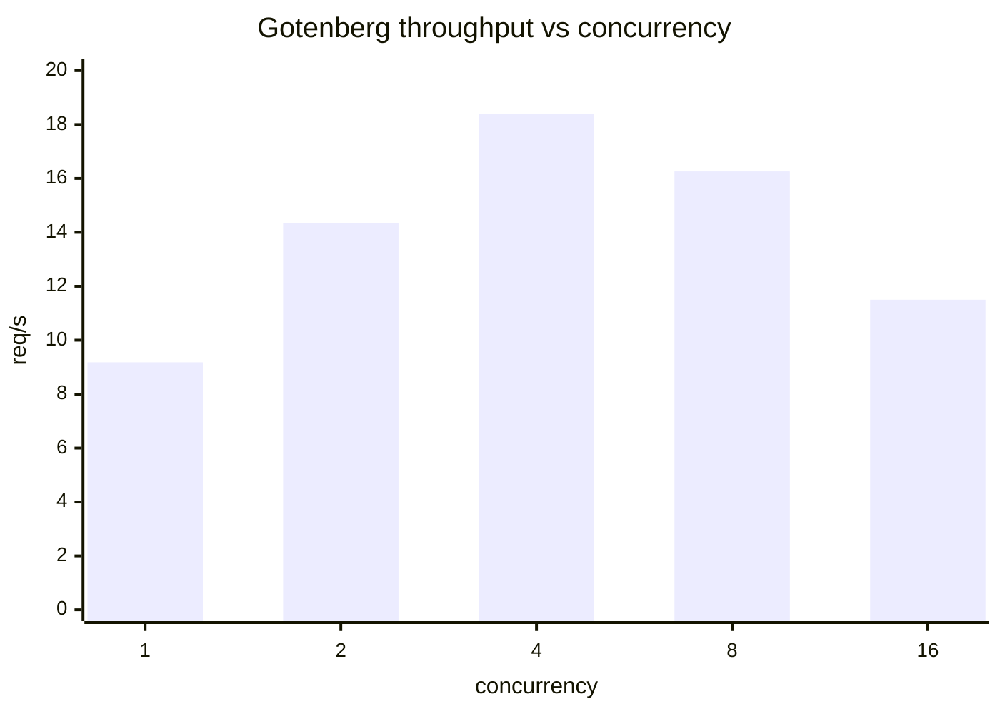
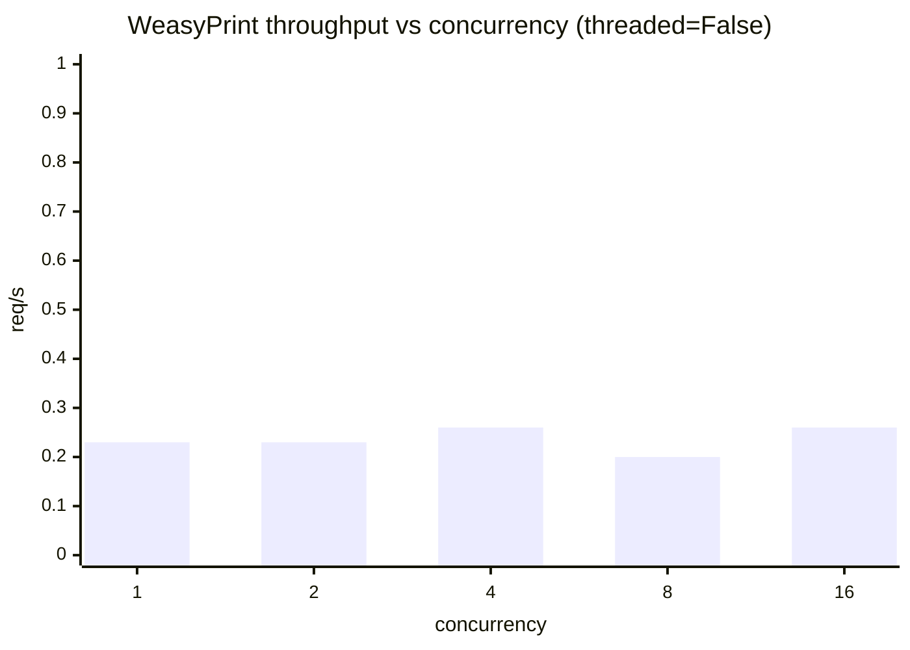

# HTML → PDF 변환 백엔드 종합 벤치마크 보고서

- 측정일: 2026-05-26
- 대상: 본 리포의 `POST /api/convert?backend=X` 엔드포인트가 위임하는 3 백엔드
  - **Gotenberg** (Chromium Headless 147, Skia/PDF m147, 로컬 Docker)
  - **WeasyPrint** (62.3 + pydyf 0.10.0, 로컬 Docker)
  - **DocRaptor** (Prince 15.1, 외부 클라우드 API, 워터마크 포함)
- 측정 차원: **동시성 곡선**(깊이) + **템플릿×언어 매트릭스**(폭) + **출력 품질**(페이지·크기·레이아웃) + **안정성**(thread-safety)
- 도구: [`cmd/loadtest`](../cmd/loadtest), [`cmd/matrix`](../cmd/matrix), 수기 비교
- 원시 데이터: [`matrix-2026-05-26.csv`](matrix-2026-05-26.csv) (36 셀), PDF 산출물 45개 [`../pdfs/`](../pdfs/)

---

## 1. TL;DR

> **한 줄 결론**: 운영 1차 백엔드는 **Gotenberg** (속도·안정성 압도적). **WeasyPrint** 는 thread-safety 픽스 적용 후 레이아웃 정확도가 필요한 비실시간 경로에서만 사용. **DocRaptor** 는 단순 명세에는 좋지만 복잡 레이아웃에서 페이지 분할 회귀가 있어 미리 검증 필수.

### 백엔드 한눈에 비교

| 기준 | Gotenberg | WeasyPrint | DocRaptor |
|------|:---------:|:----------:|:---------:|
| 단일 요청 (영문)        | **61 ~ 127 ms**  | 63 ~ 3,832 ms       | ~1.8 ~ 3.2 s |
| 단일 요청 (CJK)         | **131 ~ 392 ms** | 2,590 ~ 4,806 ms    | ~1.7 ~ 3.2 s |
| 처리량 (4-in-flight 지속, req/s) | **6 ~ 28** | 0.2 ~ 12.5 | (SLA 별도) |
| 권장 동시성             | **4**            | 1 / process         | (SLA 별도)   |
| Thread-safety           | OK               | **불가** (픽스 필요) | OK           |
| CJK 페널티 (vs 영문)    | 1.5 ~ 2x         | **최대 69x**        | ~1x          |
| 복잡 레이아웃 정확도    | 양호             | **최고**            | rowspan 회귀 |
| 비용                    | 무료 (로컬 Docker) | 무료 (로컬 Docker) | 유료 + 워터마크 |

### 핵심 발견 (테마별)

**성능** ([§3](#3-성능--동시성-곡선-단일-템플릿-깊이), [§4](#4-성능--템플릿--언어-매트릭스-콘텐츠-폭))

- **Gotenberg 동시성 sweet spot = 4.** conc=8 부터 throughput 감소, p95 5배 폭발
- **WeasyPrint CJK 페널티 최대 69x.** `nested-basic/ja`: 영문 63ms → 일본어 4,324ms. 원인은 Pango 폰트 임베드 비용
- **invoice 만 예외**: 숫자·통화 중심이라 언어 영향 1.13~1.18배 (다른 템플릿은 5~57배)

**안정성** ([§5](#5-안정성--weasyprint-thread-safety-abort-진단))

- **WeasyPrint + Flask 개발 서버 = SIGSEGV.** werkzeug 기본 `threaded=True` × WeasyPrint thread-safety 미보장 충돌
- **백트레이스로 확정 진단**: Pango 셰이핑 중 다른 스레드의 GC 와 use-after-free 충돌
- **이미 알려진 이슈** — Kozea/WeasyPrint [#167](https://github.com/Kozea/WeasyPrint/issues/167)/[#344](https://github.com/Kozea/WeasyPrint/issues/344)/[#684](https://github.com/Kozea/WeasyPrint/issues/684)/[#1402](https://github.com/Kozea/WeasyPrint/issues/1402)/[#2472](https://github.com/Kozea/WeasyPrint/issues/2472) (10년간 반복), 메인테이너 입장 "수정 안 함"
- **본 리포에 픽스 적용**: `app.run(threaded=False)`. 동일 부하에서 0/16 성공 → 16/16 성공

**출력 품질** ([§6](#6-출력-품질--페이지-수--파일-크기--레이아웃-충실도))

- **WeasyPrint 가 가장 정확** — rowspan + vertical-rl 매트릭스 1 페이지 유지, 그룹 라벨 세로쓰기 정상
- **DocRaptor 회귀**: 같은 매트릭스를 그룹마다 3 페이지로 분할, vertical-rl 텍스트가 셀 가운데로 흘러나옴
- **일본어는 페이지 +1 가능성**: 같은 의미 표현에 글자수 더 많음. `page-break-inside: avoid` 만으로는 막을 수 없음

**방법론 주석**: DocRaptor 는 외부 유료 API + 동시성 SLA 미상으로 부하 테스트(§3·§4)에서 제외, 출력 품질(§6)에만 포함.

---

## 2. 측정 환경 및 방법

### 2-1. 환경

- macOS Darwin 25.1.0
- Docker Desktop: `htp-gotenberg`, `htp-weasyprint` (각 단일 컨테이너)
- App: Go `net/http` (`make serve`, `:8080`)
- 워밍업: 첫 1 요청 (필요 시 별도 명시)

### 2-2. 측정 차원

| 차원 | 도구 | 무엇을 본다 |
|------|------|-------------|
| **동시성 깊이** (§3) | `cmd/loadtest -sweep` | 같은 템플릿/언어로 동시성 1→16 sweep. throughput 정점·tail latency 폭발 지점 |
| **콘텐츠 폭** (§4) | `cmd/matrix` | 6 템플릿 × 3 언어 × 2 백엔드 = 36 셀. 페이로드가 바뀔 때 어디서 깨지는지 |
| **출력 품질** (§6) | 수기 비교 | 같은 입력 HTML 의 3 백엔드 산출 PDF (페이지 수, 파일 크기, 레이아웃 충실도) |
| **안정성** (§5) | `cmd/matrix` + 디버그 환경 | 부하 중 프로세스 abort, 백트레이스 채집 |

### 2-3. 측정 대상 템플릿

| # | 키 | 의도 | 언어 변형 |
|---|---|---|---|
| ① | `invoice` | 표준 인보이스 (숫자·통화 중심) — `output/{ko,ja,en}.html` 로 사전 렌더 | ko/ja/en |
| ② | `nested-basic` | 카테고리별 1단 중첩, 기본 케이스 — `web/nested-basic{,-ja,-en}.html` | ko/ja/en |
| ③ | `nested-deep` | 부서 → 프로젝트 → 항목 3단 중첩 | ko/ja/en |
| ④ | `nested-split` | `page-break-inside: auto` + 대형 행으로 페이지 경계 횡단 | ko/ja/en |
| ⑤ | `nested-projects` | 프로젝트별 다중 nested grid (`page-break-inside: avoid`) | ko/ja/en |
| ⑥ | `nested-stress` | 종합 스트레스 (긴 표 thead 반복 + rowspan + vertical-rl + 14열 가로폭 + `word-break` + `@page` 마진박스 + 인라인 SVG) | ko/ja/en |

크기: 5KB (`nested-basic`) ~ 26KB (`nested-stress`).

### 2-4. DocRaptor 제외 사유

외부 클라우드 API, 유료, 워터마크, 동시성 SLA 미상. **출력 품질 비교(§6)에는 포함**, 부하/매트릭스(§3·§4)에서는 제외.

---

## 3. 성능 — 동시성 곡선 (단일 템플릿 깊이)

같은 페이로드(`output/en.html`, 12KB)를 동시성 1, 2, 4, 8, 16 으로 sweep. 각 레벨당 16 요청.

### 3-1. Gotenberg



| 동시성 | req/s | avg | p50 | p95 | max |
|-------:|------:|-----|-----|-----|-----|
|  1 |  9.18 | 109ms | 102ms | 127ms | 128ms |
|  2 | 14.35 | 138ms | 135ms | 157ms | 165ms |
|  4 | **18.40** | 214ms | 205ms | 258ms | 271ms |
|  8 | 16.26 | 439ms | 423ms | 656ms | 768ms |
| 16 | 11.50 | 742ms | 586ms | 1382ms | 1391ms |

- conc=1 → 2: 처리량 1.56배, 지연 거의 그대로 — 무비용 증설
- conc=4 가 **throughput 정점**. 이후 모두 손해:
  - conc=8: throughput −12%, p95 2.5배
  - conc=16: throughput −38%, p95 5.4배

### 3-2. WeasyPrint (`threaded=False` 픽스 적용 상태)



| 동시성 | req/s | avg | p50 | p95 | max |
|-------:|------:|-----|-----|-----|-----|
|  1 | 0.23 |  4355ms |  3756ms |  3874ms | 13241ms |
|  2 | 0.23 |  8579ms |  7625ms | 17157ms | 17285ms |
|  4 | 0.26 | 13968ms | 15378ms | 15563ms | 15570ms |
|  8 | 0.20 | 33786ms | 31086ms | 46355ms | 50234ms |
| 16 | 0.26 | 33313ms | 31483ms | 58496ms | 62372ms |

- **처리량이 동시성과 무관하게 0.20 ~ 0.26 req/s 로 평탄**. `threaded=False` 로 서버가 요청을 직렬화하기 때문에 추가 워커는 큐에 쌓일 뿐
- **지연만 비례 폭증**: conc=1 avg 4.4s → conc=8 avg 33.8s, p95 46.4s
- 같은 프로세스 내에서 WeasyPrint 동시성을 늘리는 것은 **사용자 체감만 악화**시키며 throughput 이득은 0
- 진짜 동시성이 필요하면 **별도 프로세스(`gunicorn -w N --threads 1`)** 로 확장 — §5, §7-2 참조

---

## 4. 성능 — 템플릿 × 언어 매트릭스 (콘텐츠 폭)

각 (template, language, backend) 셀에서 baseline 1회 + **4 워커 in-flight 지속 부하 8 요청**. WeasyPrint 는 `threaded=False` 픽스 적용 상태에서 재측정 (모든 셀 8/0 fail = 100% 성공).

> 본 보고서의 "**conc=4**" / "**4-in-flight**" 는 **4 워커가 동시에 변환 요청을 처리하는 상태를 유지하면서 총 N건을 처리**한다는 의미다. 단발 4건 배치가 아니라, 한 워커가 끝나면 즉시 다음 요청을 시작해 *항상 4건이 in-flight* 인 상태. `req/s = 완료_요청수 / 벽시계_총시간`.

### 4-1. 가장 중요한 발견: WeasyPrint 의 CJK 페널티

영어를 1.0 기준으로 한 상대 baseline:

| Template          | en   | ko 배수   | ja 배수   |
|-------------------|-----:|----------:|----------:|
| nested-basic      | 1.0  | **41.1x** | **68.6x** |
| invoice           | 1.0  | 1.13x     | 1.18x     |
| nested-deep       | 1.0  | 10.3x     | 10.7x     |
| nested-split      | 1.0  | 5.7x      | 6.2x      |
| nested-projects   | 1.0  | 11.3x     | 11.9x     |
| nested-stress     | 1.0  | 11.3x     | 12.3x     |

> 동일 측정을 Gotenberg 로 하면 ko 배수가 1.6~1.9 수준. **CJK 페널티는 WeasyPrint(Pango/Cairo) 고유 이슈**.

invoice 만 유독 영향이 작은 이유: 페이지가 숫자·날짜·통화 중심이라 CJK 비중이 낮음. nested-basic 은 같은 5KB 라도 본문 텍스트 비중이 높아 페널티가 가장 크게 드러남.

### 4-2. 매트릭스 baseline (모든 36 셀, ms)

| Template          | KB   | Lang | Gotenberg | WeasyPrint | WeasyP / Gtb |
|-------------------|-----:|:----:|----------:|-----------:|-------------:|
| nested-basic      |  5.5 | ko   |    189    |    2590    | 13.7x        |
| nested-basic      |  5.6 | ja   |    131    |    4324    | 33.0x        |
| nested-basic      |  5.4 | en   |     61    |      63    |  1.0x        |
| invoice           | 12.5 | ko   |    232    |    4316    | 18.6x        |
| invoice           | 12.5 | ja   |    392    |    4518    | 11.5x        |
| invoice           | 12.2 | en   |    127    |    3832    | 30.2x        |
| nested-deep       | 13.3 | ko   |    147    |    2758    | 18.8x        |
| nested-deep       | 13.6 | ja   |    234    |    2888    | 12.3x        |
| nested-deep       | 13.0 | en   |     84    |     269    |  3.2x        |
| nested-split      | 14.0 | ko   |    141    |    2828    | 20.1x        |
| nested-split      | 14.2 | ja   |    167    |    3047    | 18.2x        |
| nested-split      | 13.6 | en   |     80    |     494    |  6.2x        |
| nested-projects   | 21.2 | ko   |    158    |    3119    | 19.7x        |
| nested-projects   | 21.5 | ja   |    162    |    3284    | 20.3x        |
| nested-projects   | 20.5 | en   |     85    |     275    |  3.2x        |
| nested-stress     | 25.9 | ko   |    164    |    4408    | 26.9x        |
| nested-stress     | 26.3 | ja   |    200    |    4806    | 24.0x        |
| nested-stress     | 25.2 | en   |     96    |     390    |  4.1x        |

### 4-3. 4-in-flight 지속 처리량 요약

| 환경 | Gotenberg | WeasyPrint | 비고 |
|------|----------:|-----------:|------|
| CJK 평균 (ko/ja) | 10.9 req/s | 0.29 req/s | WeasyPrint 는 1 req/s 미만 |
| 영문 평균 | 22.7 req/s | 4.80 req/s | `invoice/en` 만 0.26 outlier (baseline 3.8s); 제외 시 평균 5.7 req/s |

극단 케이스 (`nested-stress/ko`, 4-in-flight):
- Gotenberg 12.8 req/s, p95 310ms
- WeasyPrint 0.22 req/s, p95 18.5s → 사용 불가

---

## 5. 안정성 — WeasyPrint thread-safety abort 진단

### 요약

부하 테스트 중 WeasyPrint 프로세스가 `free(): invalid pointer` 로 abort. 디버그 환경(`PYTHONFAULTHANDLER=1`, `MALLOC_CHECK_=3`, `MALLOC_PERTURB_=42`)에서 백트레이스 채집 → **werkzeug 기본 `threaded=True` × WeasyPrint thread-safety 미보장** 충돌로 확정. 여러 스레드가 동시에 Pango 셰이핑(`weasyprint/text/line_break.py`)에 진입한 사이 한 스레드의 GC가 cffi 객체를 finalize → use-after-free → SIGSEGV.

**이건 자원 부족이 아니다.** `free(): invalid pointer` 는 glibc 의 `free()` 가 손상된 힙·잘못된 포인터를 감지해 `abort()` 한 메시지로, C 레벨 메모리 손상 버그(double free / 잘못된 주소 free / 힙 청크 손상)를 의미한다. OOM 시그니처(`Cannot allocate memory`, `MemoryError`, `OOMKilled`) 와는 다르다.

### 픽스 + 검증

`server.py` 에 `threaded=False` 한 줄 추가:

| 시나리오 | `nested-deep/en` concurrent (16 req @ conc=4) |
|----------|------------------------------------------------|
| `threaded=True` (이전) | **0 / 16 성공**, exit 139 (SIGSEGV), 컨테이너 사망 |
| `threaded=False` (수정 후) | **16 / 16 성공**, p95 525 ms, 컨테이너 정상 |

본 리포에 적용된 변경: `weasyprint/server.py` (`threaded=False`), `weasyprint/Dockerfile` (`gdb`, `python3-dbg`, `python -X faulthandler`), `docker-compose.yml` (디버그 env vars).

### 업스트림

WeasyPrint 자체는 thread-safe 가 아님을 공식 인정 (메인테이너 [#684](https://github.com/Kozea/WeasyPrint/issues/684): *"not designed to be thread-safe neither"*). 동일 클래스 segfault 가 10년간 반복 보고됨 ([#167](https://github.com/Kozea/WeasyPrint/issues/167)·[#344](https://github.com/Kozea/WeasyPrint/issues/344)·[#684](https://github.com/Kozea/WeasyPrint/issues/684)·[#1402](https://github.com/Kozea/WeasyPrint/issues/1402)·[#2472](https://github.com/Kozea/WeasyPrint/issues/2472)). 공식 docs 에 thread-safety 경고가 0줄이라는 documentation 갭이 있어, 별도 브랜치 [`weasyprint-thread-safety-contrib`](https://github.com/shlee-massive/html2pdf/tree/weasyprint-thread-safety-contrib/contrib) 에 docs PR 초안 + 최소 재현 스크립트를 작성해 두었다.

### 운영 권고

- WeasyPrint 사용 시 **반드시** `threaded=False` 또는 multi-process 단일 스레드 서버 (`gunicorn -w N --threads 1`)
- celery 는 prefork 풀 (또는 gevent + 큐 동시성 1)
- 진짜 동시성이 필요하면 워커 프로세스 수로 확보, 같은 프로세스 안에서는 절대 멀티스레드 호출 금지

---

## 6. 출력 품질 — 페이지 수 × 파일 크기 × 레이아웃 충실도

`nested-*` 5종 × ko/ja/en × 3 백엔드 = 45 PDF 비교 (산출물: [`../pdfs/`](../pdfs/)). 본 절은 DocRaptor 포함.

### 6-1. 페이지 수 × 파일 크기 × 변환 시간

#### ① 카테고리별1단 (`nested-basic`)

| 로케일 | gotenberg | weasyprint | docraptor |
|---|---|---|---|
| **ko** | 1p · 150 KB · 0.15s | 1p · 289 KB · 2.63s | 1p · 56 KB · 2.59s |
| **ja** | 1p · 135 KB · 0.17s | 1p · 292 KB · 2.79s | 1p · 45 KB · 1.80s |
| **en** | 1p · **35 KB** · 0.10s | 1p · **13 KB** · **0.06s** | 1p · 50 KB · 2.26s |

#### ② 프로젝트분할 (`nested-projects`)

| 로케일 | gotenberg | weasyprint | docraptor |
|---|---|---|---|
| **ko** | 2p · 266 KB · 0.19s | 2p · 318 KB · 3.35s | **5p** · 100 KB · 1.95s |
| **ja** | **3p** · 287 KB · 0.25s | **3p** · 326 KB · 3.30s | **6p** · 97 KB · 1.82s |
| **en** | 2p · **54 KB** · 0.12s | 2p · **27 KB** · 0.29s | **5p** · 82 KB · 1.76s |

#### ③ 3단중첩 (`nested-deep`)

| 로케일 | gotenberg | weasyprint | docraptor |
|---|---|---|---|
| **ko** | 2p · 247 KB · 0.17s | 2p · 306 KB · 2.92s | 2p · 99 KB · 3.15s |
| **ja** | 2p · 267 KB · 0.22s | 2p · 316 KB · 2.94s | 2p · 97 KB · 1.79s |
| **en** | 2p · **56 KB** · 0.11s | 2p · **24 KB** · 0.27s | 2p · 85 KB · 1.88s |

#### ④ 행잘림테스트 (`nested-split`)

| 로케일 | gotenberg | weasyprint | docraptor |
|---|---|---|---|
| **ko** | 2p · 270 KB · 0.20s | 2p · 310 KB · 2.93s | **3p** · 94 KB · 1.80s |
| **ja** | 2p · 331 KB · 0.23s | 2p · 325 KB · 3.23s | **3p** · 96 KB · 1.80s |
| **en** | 2p · **69 KB** · 0.12s | 2p · **29 KB** · 0.55s | **3p** · 80 KB · 1.81s |

#### ⑤ 종합스트레스 (`nested-stress`)

| 로케일 | gotenberg | weasyprint | docraptor |
|---|---|---|---|
| **ko** | 3p · 333 KB · 0.22s | 3p · 466 KB · 4.78s | **6p** · 150 KB · 1.87s |
| **ja** | 3p · **480 KB** · 0.24s | 3p · 489 KB · 5.16s | **6p** · 144 KB · 1.70s |
| **en** | 3p · **66 KB** · 0.14s | 3p · **36 KB** · 0.43s | **6p** · 100 KB · 1.79s |

### 6-2. 로케일별 패턴

#### 영어가 모든 면에서 가장 가벼움
- 파일 크기: 영어 WeasyPrint 결과가 한국어의 **1/13 ~ 1/22**
  - basic: 13 KB(en) vs 289 KB(ko)
  - stress: 36 KB(en) vs 466 KB(ko)
- 변환 시간: 영어 WeasyPrint 가 0.06 ~ 0.55s 로 ko/ja(2.6 ~ 5.2s) 대비 압도적으로 빠름
- 원인: CJK 폰트(Noto Sans JP/KR) 글리프 임베드가 영어에서는 불필요. WeasyPrint 가 폰트 풀 임베드를 해서 가장 큰 영향

#### 일본어 ② 프로젝트분할이 페이지 1장 더
- ko: 2p → ja: **3p** → en: 2p (3 백엔드 모두 같은 패턴)
- 원인: 일본어 텍스트가 같은 의미 표현에 글자수 더 많음 (직위·역할 라벨 "PM"/"バックエンドエンジニア"). 7번째 프로젝트 행의 내부 grid 가 한 줄 더 차지하면서 페이지 넘김
- 의미: **`page-break-inside: avoid` 만으로는 페이지 수 증가를 막을 수 없다** — 콘텐츠 자체 길이를 디자인 단계에서 고려해야 함

#### 일본어 ⑤ 종합스트레스의 Gotenberg 결과가 한국어보다 큼
- ko gotenberg: 333 KB → ja gotenberg: **480 KB** (+44%)
- 같은 stress 의 WeasyPrint 는 466 → 489 KB (+5%)
- 원인 추정: Chromium 의 폰트 임베드는 사용 글리프 수에 더 민감. 일본어가 한국어보다 표시 글리프 수 더 많음 (히라가나 + 가타카나 + 한자)

#### DocRaptor 의 페이지 분할은 로케일 무관
- ② `nested-projects` docraptor: ko 5p → ja 6p → en 5p (rowspan 분할 + 일본어 +1)
- ⑤ `nested-stress` docraptor: ko/ja/en **모두 6p** — rowspan 그룹마다 페이지를 갈라버리는 동작
- 의미: DocRaptor 의 매트릭스 분할 이슈는 **구조(rowspan + writing-mode)** 에서 비롯됨. 로케일 바꿔도 해결 안 됨

### 6-3. rowspan 매트릭스 — 백엔드 차이가 가장 크게 드러나는 케이스

`종합스트레스` 의 `월별 청구 매트릭스` (7행 × 14열, `rowspan="3"`/`rowspan="2"` 그룹 라벨, `writing-mode: vertical-rl` 세로쓰기):

| 백엔드 | 매트릭스 페이지 수 | 그룹 라벨 표현 |
|---|---|---|
| weasyprint | 1 페이지 (전체) | 그룹 셀 안에 세로쓰기로 정상 배치 — **가장 의도대로** |
| gotenberg | 1 페이지 | 세로쓰기 OK, 위치는 약간 어색 — **실용적** |
| docraptor | **3 페이지 분할** (인프라/SaaS/서비스 각각) | vertical-rl 텍스트가 셀 가운데로 흘러나옴, 그룹 결합 깨짐 |

### 6-4. 패턴별 동작 비교

`nested-stress` 에 의도적으로 녹여둔 6 패턴 (A~F) 의 백엔드별 동작:

| 패턴 | gotenberg | weasyprint | docraptor |
|---|---|---|---|
| A. thead 반복 (긴 표) | OK | OK | OK |
| B. rowspan 매트릭스 | OK (vertical-rl 약간 어색) | **가장 깔끔** | **rowspan 그룹마다 페이지 분할** |
| C. 12열 가로폭 | OK | OK | OK |
| D. 긴 URL / CJK 부서명 (`word-break: break-all`) | OK | OK | OK |
| E. `@page` 마진 박스 (페이지 번호) | OK (Chromium 147 지원) | OK | OK |
| F. 인라인 SVG | OK | OK | OK |

### 6-5. 부수 발견

- **WeasyPrint pydyf 호환성 이슈**: pip 최신 pydyf(0.11+) 가 `Stream.transform` 메서드를 제거했는데 weasyprint 62.3 이 호출함 → `AttributeError`. 해결: `pydyf==0.10.0` 핀 (`weasyprint/Dockerfile`)
- **Chromium `@page` 마진 박스 진전**: 과거 Chrome 은 `@page @bottom-center` 등을 무시했으나, Chrome 147 / Skia PDF m147 에서는 `counter(page) " / " counter(pages)` 페이지 번호가 정상 출력
- **DocRaptor 워터마크는 페이지 수와 무관**: 페이지 분할은 콘텐츠 구조에서 비롯되며 워터마크 때문이 아님

---

## 7. 종합 권고

### 7-1. 백엔드 선택

| 우선 순위 | 권장 백엔드 | 이유 |
|-----------|------------|------|
| **속도** (대량 배치, 실시간) | Gotenberg | 다른 백엔드의 10배 이상 빠름. CJK 영향 1.5~2배 이내 |
| **레이아웃 정확도** (복잡한 nested, rowspan, vertical-rl, `@page` 풀 활용) | WeasyPrint | 표준 CSS 동작이 가장 충실 |
| **운영 편의성 (zero-ops)** · 인쇄·출판 품질 | DocRaptor | Prince 엔진. 인프라 0 — 폰트·thread-safety·컨테이너 안정성 모두 무관 |

#### DocRaptor 가 합리적인 경우

이번 보고서가 직접 겪은 운영 비용 (WeasyPrint thread-safety 진단, 폰트 의존성 설치, 컨테이너 다운 대응, threaded/MALLOC env 튜닝, gunicorn 워커 수 결정 등) 이 **모두 사라진다** 는 것이 DocRaptor 의 본질적 가치다.

- **장점**: 인프라·폰트·thread 0 부담, Prince 의 인쇄급 품질, CJK 페널티 거의 없음(§6-1 표에서 ko/ja/en 시간 거의 동일), 최소 PDF 크기(영리한 폰트 서브셋팅), PDF/A · PDF/UA 지원
- **단점**: 요청당 과금, 무료 티어 워터마크, 네트워크 의존 (baseline 1.7~3.2s 는 거의 RTT), 민감 데이터 외부 전송 불가 (온프렘 옵션 없음), `rowspan` + `vertical-rl` 같은 가장자리 케이스 페이지 분할 회귀
- **적합**: 트래픽이 많지 않거나 PDF 변환이 핵심 가치가 아닌 팀, 운영 인력이 부족한 팀, 인쇄 품질이 중요한 단일 양식(계약서/증명서 등)
- **부적합**: 대량 배치, 비용 민감, 데이터 외부 전송 불가, 또는 본 보고서가 발견한 가장자리 케이스 레이아웃을 그대로 써야 하는 경우

### 7-2. 동시 처리 설정

| 백엔드 | 권장 동시성 | 비고 |
|--------|------------|------|
| Gotenberg  | **4** | 정점 이후 throughput 감소 + p95 폭발 |
| WeasyPrint | **1 per process** | thread-safe 아님. 진짜 동시성 필요 시 `gunicorn -w N --threads 1` |
| DocRaptor  | (SLA 별도 확인) | 본 보고서 범위 밖 |

### 7-3. 다국어 청구서 시스템

- **언어별 평균 PDF 크기 분포가 크게 다름** → 스토리지 추산 시 단순 평균 X, 언어 비율로 가중평균
- **WeasyPrint + 영어** 조합은 거의 정적 사이트 만큼 가벼움 (13~36 KB / 0.06~0.55s)
- **일본어 콘텐츠는 페이지 +1** 가능성을 청구서 디자인 단계부터 고려

### 7-4. WeasyPrint 운영

- 운영에서 사용하려면 **반드시** `threaded=False` 또는 multi-process single-thread 서버
- `docker-compose.yml` 에 healthcheck + `restart: unless-stopped` (혹시 누락된 멀티스레드 경로 대비)
- 본 리포처럼 부하 테스트로 진단 시 `PYTHONFAULTHANDLER=1`, `MALLOC_CHECK_=3` 환경변수 + `python -X faulthandler` 권장

---

## 8. 부록

### 8-1. 재현

```bash
# 사전 준비
make up         # gotenberg + weasyprint 컨테이너
make serve &    # 데모 서버 (:8080)
make run-ko && make run-ja && make run-en   # output/*.html 생성

# 동시성 sweep (§3 재현)
go run ./cmd/loadtest -backend gotenberg  -sweep -sweep-total 16
go run ./cmd/loadtest -backend weasyprint -sweep -sweep-total 16

# 매트릭스 (§4 재현)
go run ./cmd/matrix -out reports/matrix.csv

# 부분 매트릭스 (특정 백엔드/템플릿만)
go run ./cmd/matrix -backends weasyprint \
                    -templates nested-deep,nested-stress \
                    -cooldown 3s \
                    -append -out reports/matrix.csv
```

### 8-2. 안정성 디버그 환경

`docker-compose.yml` 의 weasyprint 서비스에 이미 적용됨:

```yaml
environment:
  MALLOC_CHECK_: "3"
  MALLOC_PERTURB_: "42"
  PYTHONFAULTHANDLER: "1"
  PYTHONUNBUFFERED: "1"
```

`weasyprint/Dockerfile` 의 CMD:

```dockerfile
CMD ["python", "-X", "faulthandler", "server.py"]
```

### 8-3. 원시 데이터

- 매트릭스 36 셀: [`matrix-2026-05-26.csv`](matrix-2026-05-26.csv)
- 출력 PDF 45개: [`../pdfs/`](../pdfs/) (총 7.9 MB)

### 8-4. 도구

- [`cmd/loadtest`](../cmd/loadtest) — 동시성 sweep
- [`cmd/matrix`](../cmd/matrix) — 템플릿 × 언어 × 백엔드 매트릭스
- [`contrib/`](../contrib) — WeasyPrint docs PR 초안 (별도 브랜치 `weasyprint-thread-safety-contrib` 에서 작업)

### 8-5. 측정 백로그

- WeasyPrint Pango 폰트 캐시 워밍 효과 (첫 요청 vs 이후 요청)
- Gotenberg `GOTENBERG_API_TIMEOUT`, Chromium worker 수 튜닝
- 컨테이너 CPU/메모리 limit 별 곡선 이동
- DocRaptor 는 부하 테스트 대신 SLA 기반 소량 샘플링으로 별도 평가
